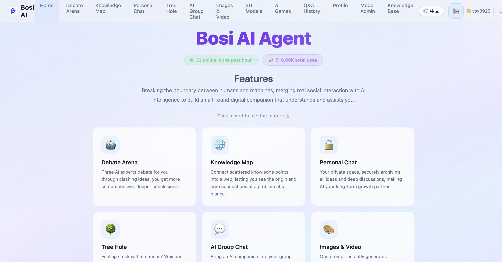

# 博思AI智能体 · 多模型协作与智能辩论平台

> **让多个 AI 像专家团队一样为你辩论、推理、共创。**
>
> 制作者：杨思义 · 博思AI团队 · 2026年8月

[](LICENSE)
[](.github/workflows/ci.yml)
[](pom.xml)
[](pom.xml)
[](#运行测试)
[](frontend/package.json)

[English](README.en.md) | 简体中文

**许可证**：本项目采用 [Apache License 2.0](LICENSE) 开源协议，可自由使用、修改、分发。

---

## 产品简介

博思AI智能体是一个**多模型智能协作平台**。不同于传统 AI 产品"一个模型回答一个问题"的单声道模式，博思AI 让**豆包、DeepSeek、千问**等多个大模型同时参与对话、展开辩论、协作完成复杂任务，并融合 RAG 知识检索、多模态生成、AI 游戏于一体，提供一站式 AI 体验。

- **在线体验**：http://112.124.106.108/chat/home
- **源码仓库**：https://github.com/ysy0915/chat-system

> 在线环境已启用安全拦截（UA 校验），脚本调用 API 请携带浏览器 `User-Agent` 头；浏览器正常访问不受影响。

### 与传统 AI 产品的区别

| 传统 AI 产品 | 博思AI智能体 |
|---|---|
| 单一模型回答 | 多模型群聊 + 三方辩论 |
| 黑盒推理 | 思考链实时透明展示 |
| 所有问题同一参数 | 意图三层漏斗分级处理 |
| 聊天/绘画/视频分散在不同 App | 聊天、辩论、创作、游戏统一入口 |
| 模型报错就卡住 | 自动换模型/重试/降级，服务不中断 |

---

## 功能全景

### AI 伙伴群聊
多个 AI 模型同时参与公开聊天室，支持流式输出、在线人数实时显示、跨用户问答可见。

### 个人对话空间
JWT 认证的私密 AI 对话，历史记录持久化，支持文件上传、语音输入、语音朗读、历史搜索、模型切换、重新生成。知识/事实类问题自动触发 RAG 检索增强。

### 观点辩论场
- **标准辩论**：从已配置 chat 模型随机抽取 **3~6 个模型组队**（模型数可自选，名称中文展示），场次可选 1~10 轮，每轮反思修正 + 裁决式汇总；支持 Redis 外存**跨会话记忆**（同话题二次辩论首轮即带历史立场）与**反思过程可视化**（Reflection 阶段前端实时提示）
- **树状辩论**：LLM 自动拆解问题为 2-3 个分析视角 → 各视角由 3 个快模型独立并行辩论（自动排除本地慢模型提速）→ 综合汇总，前端可拖拽 DAG 树图可视化

### 情绪树洞
匿名情绪倾诉空间，AI 共情回复。**Memory 记忆增强**：LLM 提炼用户画像（情景/情绪/偏好），回答逐步贴合个人偏好。三层记忆：Redis 短期 → Milvus 长期向量 → 用户画像。

### 多模态生成
文生图 / 文生视频 / 图生 3D 模型（GLB/OBJ/STL）

### AI 多人游戏
城堡围攻（AI 领主实时对战）、蛇王争霸（多人贪吃蛇）、AI 乒乓球

### 知识库 RAG
上传 PDF/Word/TXT → 自动解析分块 → Milvus 向量存储 → 对话时意图驱动自动检索增强回答

### 知识脉络图
Neo4j 图数据库存储实体与关系，LLM 自动抽取三元组，前端 Canvas 可视化展示知识网络

### Multi-Agent 并行工作流
超长/跨域复杂请求自动拆解为 ≤9 个子任务 → RabbitMQ 分发到双实例 10 并发 Worker 并行执行 → 收敛压缩 ≤1000 字。全局限流 + 公平分发 + 死信重试 + 对账兜底。

---

## 核心创新点

### 1. 意图识别三层漏斗
按命中概率分配计算资源：L1 规则(0-1ms) → L2 语义(30-80ms) → L3 LLM(200-1000ms)，L1+L2 命中率目标 >95%，意图驱动 Temperature 自动调参（代码 0.2 / 创意 0.95 / 翻译 0.1），L3 高置信结果自动灌回 L1/L2（自增强闭环）。

### 2. 树状辩论 — Plan-and-Execute + LangGraph 混合编排
LLM 拆解视角（Plan）→ Java CompletableFuture 视角间并行 + LangGraph4j StateGraph 视角内循环辩论（Execute）→ LLM 综合汇总（Aggregate）。单视角失败不影响其他，汇总失败自动本地拼接。

### 3. 思考链实时展示
三态状态机逐 token 分离推理过程，11 字符缓冲零延迟推送，300 字符安全降级，仅实时展示不存库。

### 4. AI 错误自愈
频率/认证/网络/解析错误分类恢复（换模型/重试/降级），叠加 Resilience4j 熔断器（50% 失败率 → 30s 熔断）双层防御。

### 5. Multi-Agent 可靠性闭环
Redis Lua 原子限流（8 并行 / 超限降级）+ manual ack 零丢失 + DLX 死信指数退避重试 + Reconciler 30s 对账兜底（服务器重启后自动恢复）。

### 6. 对话自动 RAG
知识/事实类问题自动检索知识库增强回答，可查性三层判定（开关 → 意图 → 排除实时/个人数据），未命中自动降级普通回答。

---

## 技术架构

```
表现层    React SPA（KeepAlive 常驻页 · SockJS/STOMP 流式）
          · 思考链渲染 · 树状辩论 DAG 画布 · 知识图谱 Canvas · 移动端适配

接入层    chat-web（端口 8081）
          JWT 认证 · 三层限流 · 内容安全 · WebSocket · CoreClient 负载均衡

业务层    chat-core（端口 9090 主 / 9092 从，双实例高可用）
          聊天/辩论/树洞编排 · 意图三层漏斗 · Agent 工具 · 思考链 · Multi-Agent 工作流

AI 能力层 chat-llm（端口 9095）  多 Provider 策略 + 图执行引擎 + RAG + 知识图谱 + gRPC
          chat-games（端口 8083） · chat-media（端口 8084）

基础设施  MySQL(RDS) · Redis · RabbitMQ · Nacos · Neo4j · Milvus
          Prometheus 监控栈（12 条告警规则 → 钉钉推送）
```

| 层级 | 技术 |
|------|------|
| **后端框架** | Spring Boot 3.1, Spring Cloud (Nacos), MyBatis, gRPC |
| **AI 引擎** | chat-llm 独立 LLM 服务（多 Provider：OpenAI 兼容 / DeepSeek / 豆包）+ 自研 LangGraph 风格图执行引擎 |
| **知识库** | Milvus 向量数据库 + Embedding + RAG 检索增强 |
| **消息中间件** | RabbitMQ（跨节点广播 · Multi-Agent 子任务分发 · DLX 死信重试） |
| **数据库** | MySQL + Redis + Neo4j |
| **可观测性** | Prometheus + Alertmanager + Micrometer Tracing + AOP 切面业务指标 |
| **前端** | React 18 + Vite + Router v6 + WebSocket 流式 |
| **部署** | Docker + Docker Compose + Nginx + 双服务器架构 |

---

## 项目结构

```
chat-system-project/
├── chat-common/       # 公共库（实体、DTO、安全、工具、拦截器）
├── chat-core/         # 核心 AI 服务（业务编排、Agent工具、意图识别）      端口 9090(主)/9092(从)
├── chat-web/          # Web 接入层（Controller、WebSocket）              端口 8081
├── chat-llm/          # 独立 LLM 服务（多 Provider、图执行引擎、RAG、知识图谱、gRPC） 端口 9095
├── chat-games/        # 游戏服务（城堡围攻、乒乓、贪吃蛇）                 端口 8083
├── chat-media/        # 多模态服务（文生图、文生视频、图生3D）             端口 8084
├── frontend/          # 前端 SPA（React + Vite）
├── scripts/           # 运维脚本（部署、重启、监控、迁移）
└── docs/              # 完整文档（7 类文档中心 + ADR + 部署配置资产）
```

---

## 平台预览



> 多模型协作与智能辩论平台首页 — 集成辩论场、知识图谱、个人对话、情绪树洞、AI 群聊、多模态生成等核心能力。

## 快速开始

### 方式一：Docker 一键启动（推荐）

```bash
# 一键启动全部中间件 + 编译 + 后端 + 前端
bash scripts/quickstart.sh

# 或只启动中间件（MySQL/Redis/RabbitMQ/Nacos/Milvus/Neo4j）
bash scripts/quickstart.sh infra

# 停止
bash scripts/quickstart.sh stop
```

> 前置要求：Docker + JDK 17 + Maven 3.8+ + Node 18+
>
> 也可直接使用 Docker Compose：
> ```bash
> docker compose --profile all up -d    # 完整部署（后端 + 前端 + 中间件）
> docker compose --profile dev up -d    # 仅中间件（本地开发）
> ```

### 方式二：本机开发（手动启动）

### 环境要求

- JDK 17+
- Maven 3.8+
- Node.js 18+
- MySQL 8.0, Redis 6+, RabbitMQ 3.9+
- Milvus 2.3+ (可选，知识库功能需要)

### 本机开发

```bash
# 1. 启动基础设施
brew install redis rabbitmq
brew services start redis
brew services start rabbitmq

# 2. 打包
mvn clean install -DskipTests

# 3. 启动 chat-llm（LLM 独立服务，需先于 core 启动）
java -jar chat-llm/target/chat-llm-0.0.1-SNAPSHOT.jar \
  --spring.profiles.active=local --server.port=9095

# 4. 启动 chat-core（核心 AI 服务）
java -jar chat-core/target/chat-core-0.0.1-SNAPSHOT.jar \
  --spring.profiles.active=local --server.port=9090

# 5. 新终端启动 chat-web（Web 接入层）
java -jar chat-web/target/chat-web-0.0.1-SNAPSHOT.jar \
  --spring.profiles.active=local --server.port=8080 \
  --app.core.base-url=http://127.0.0.1:9090

# 6. 启动前端
cd frontend && npm install && npm run dev
```

访问：
- 前端：http://localhost:5173
- API：http://localhost:8080/api/v1/*
- Swagger UI：http://localhost:8080/swagger-ui.html

> **API 调用提示**：生产环境启用了安全拦截（UA 校验 + 敏感接口限流），脚本/工具调用 API 时请携带浏览器 `User-Agent` 头，否则会返回 `403`。示例：
> ```bash
> curl -H "User-Agent: Mozilla/5.0" http://localhost:8080/api/v1/messages/online-count
> ```

### LLM 独立部署（standalone 纯内存模式）

chat-llm 支持**零外部依赖独立部署**：无需 MySQL/Redis/Neo4j/Milvus，模型管理面、RAG 检索、对话记忆、知识图谱四大能力全部使用纯内存实现，单个进程即可完整体验。适合本地演示、单机验证或作为通用 LLM 网关使用。

#### JAR 启动

```bash
# 1. 打包（只需 chat-llm 及其依赖 chat-common）
mvn clean install -DskipTests -pl chat-llm -am

# 2. 配置 API Key（需要哪个厂商配哪个，不配则该厂商不可用但应用正常启动）
export DEEPSEEK_API_KEY=sk-xxx      # DeepSeek
export QWEN_API_KEY=sk-xxx          # 千问（RAG 向量化缺省也复用此 Key）
export DOUBAO_API_KEY=sk-xxx        # 豆包
# 可选：单独指定向量化 Key（缺省回退 QWEN_API_KEY）
export EMBEDDING_API_KEY=sk-xxx

# 3. 启动 standalone（HTTP 9095 / gRPC 9195）
java -jar chat-llm/target/chat-llm-0.0.1-SNAPSHOT.jar \
  --spring.profiles.active=standalone --server.port=9095
```

#### Docker 启动

```bash
# 构建镜像（Dockerfile-llm 多阶段构建，无需本机 Maven/JDK）
docker build -f Dockerfile-llm -t chat-llm:latest .

# 启动容器（注入 API Key 环境变量）
docker run -d --name chat-llm \
  -p 9095:9095 -p 9195:9195 \
  -e DEEPSEEK_API_KEY=sk-xxx \
  -e QWEN_API_KEY=sk-xxx \
  chat-llm:latest
```

#### 验证

```bash
# 健康检查
curl http://localhost:9095/actuator/health

# 模型管理面：动态添加 Provider（apiKey 直接写入，存内存）
curl -X POST http://localhost:9095/api/v1/llm/admin/providers \
  -H "Content-Type: application/json" \
  -d '{"providerName":"ollama","providerType":"rest","baseUrl":"http://localhost:11434/v1","apiKey":"","models":[{"modelName":"llama3","displayName":"Llama 3"}]}'

# LLM 对话（provider/model 在请求体指定，非启动参数）
curl -X POST http://localhost:9095/api/v1/chain/invoke \
  -H "Content-Type: application/json" \
  -d '{"provider":"qwen","model":"qwen-plus","messages":[{"role":"user","content":"你好"}]}'

# SSE 流式调用
curl -N -X POST http://localhost:9095/api/v1/chain/stream \
  -H "Content-Type: application/json" \
  -d '{"provider":"qwen","model":"qwen-plus","messages":[{"role":"user","content":"写一首关于秋天的诗"}]}'
```

#### 端口说明

| 端口 | 协议 | 用途 |
|------|------|------|
| 9095 | HTTP | REST API（对话、模型管理面、RAG、知识图谱） |
| 9195 | gRPC | 图执行引擎 gRPC 接口（LangGraph 编排） |

> **注意**：内存数据**重启即清空**，仅适合本地演示 / 单机验证；生产请使用 `local` 或 `prod` profile 并接入 MySQL/Redis/Milvus/Neo4j。完整说明与全部 curl 示例见 `chat-llm/STANDALONE.md`。

### Docker 部署

```bash
# 开发环境
docker-compose up -d

# 生产环境
docker-compose -f docker-compose.yml -f docker-compose.prod.yml up -d
```

---

## 运行测试

```bash
# 全量测试（895 用例全绿）
mvn clean test

# 单模块
mvn test -pl chat-common  # 277 个测试
mvn test -pl chat-core    # 257 个测试
mvn test -pl chat-web     # 90 个测试
mvn test -pl chat-llm     # 198 个测试
mvn test -pl chat-games   # 44 个测试
mvn test -pl chat-media   # 26 个测试
```

---

## 安全与合规

| 策略 | 说明 |
|------|------|
| IP 限流 | 600 次/分钟 |
| 用户限流 | 20 次/分钟、200 次/小时 |
| 敏感接口限流 | 登录/注册 10 次/分钟 |
| 登录防爆破 | 连续 5 次失败锁定 15 分钟 |
| 注册验证码 | 算术题验证码，5 分钟有效一次性消费 |
| 自动拉黑 | 60 秒超 1000 次 → 封禁 10 分钟 |
| 内容安全 | 阿里云内容安全 API，色情/暴力/敏感内容自动拦截 |
| 数据隔离 | JWT 认证 + 用户级会话隔离，思考链不持久化 |

---

## 工程指标

| 维度 | 指标 |
|------|------|
| 测试 | 全量 **895 用例全绿**，含 @SpringBootTest 集成测试、Mapper 契约测试 |
| 代码规范 | Checkstyle **0 违规** · PMD 2000+→92 · SpotBugs 0 阻断 |
| 架构设计 | 双 core 高可用 + web 弹性伸缩（Nacos 动态 upstream）+ stop 广播 + nodeId 防堆积 + LangGraph 混合编排 + Multi-Agent 并行工作流 |
| 模型抽象 | Provider 策略 + SPI 策略工厂 + 注册中心 + 动态路由 + 模型自助管理面 + 工具平台化 + 存储 SPI 热插拔 |
| 可观测性 | Prometheus 监控栈（系统 8 + 业务 4 条告警规则）+ Micrometer Tracing 全链路追踪 |
| 文档 | 7 类文档中心 + ADR 架构决策记录（25 条）+ Swagger API 文档 |
| CI/CD | GitHub Actions CI + Deploy + Security + OWASP 依赖扫描 |
| 安全性 | JWT 弱密钥校验 + 三层限流 + DTO 校验 + 上传限制 + CORS/CSP + 内容安全过滤 |
| 压测 | 500 并发 P50 154ms，零失败 |

---

## 文档索引

> 完整分类索引见 [docs/README.md](docs/README.md)

### 架构与设计（`docs/01-架构设计/`）

| 文档 | 内容 |
|------|------|
| [架构全盘说明.md](docs/01-架构设计/架构全盘说明.md) | **总纲**：整体架构 → 模块细节 → 核心流程 → 数据流 → 部署 |
| [架构评估报告.md](docs/01-架构设计/架构评估报告.md) | 整体系统评分 + 架构说明 + 风险路线图 |
| [ADR-架构决策记录.md](docs/01-架构设计/ADR-架构决策记录.md) | 25 条关键架构决策的背景·决策·后果 |
| [LLM策略与路由说明.md](docs/01-架构设计/LLM策略与路由说明.md) | LLM 策略、路由、容错 |

### 运维与部署（`docs/03-运维部署/`）

| 文档 | 内容 |
|------|------|
| [部署运维手册.md](docs/03-运维部署/部署运维手册.md) | 本机/服务器/Docker 部署全流程、监控告警 |
| [故障排查指南.md](docs/03-运维部署/故障排查指南.md) | 常见问题现象→根因→修复步骤 |
| [CI_CD.md](docs/03-运维部署/CI_CD.md) | GitHub Actions 流水线、自动部署、回滚策略 |

### 交付材料（`docs/06-交付材料/`）

| 文档 | 内容 |
|------|------|
| [产品说明.md](docs/06-交付材料/产品说明.md) | 产品定位、功能全景、技术架构、使用指南 |
| [项目概述.md](docs/06-交付材料/项目概述.md) | 目标用户、核心诉求、创新点 |
| [方案PPT内容.md](docs/06-交付材料/方案PPT内容.md) | 方案 PPT 内容脚本 |

---

## 贡献

欢迎贡献！无论是提交 Bug、新功能还是改进文档，请先阅读 [CONTRIBUTING.md](CONTRIBUTING.md) 了解贡献流程与代码规范。

- 报告 Bug / 提需求：使用 [Issue 模板](.github/ISSUE_TEMPLATE/)
- 提交代码：Fork → 特性分支 → PR（需通过 CI）
- 行为准则：[CODE_OF_CONDUCT.md](CODE_OF_CONDUCT.md)

## 许可证

本项目采用 [Apache License 2.0](LICENSE) 开源协议。

---

## 关于

- **制作者**：杨思义 · 博思AI团队
- **GitHub**：https://github.com/ysy0915/chat-system
- **在线体验**：http://112.124.106.108/chat/home

### 项目历程

本项目于 **2026 年 7 月底立项**，历经约两周完成从设计到上线的完整迭代，核心演进轨迹：

| 时间 | 里程碑 |
|------|--------|
| 07-30 | 项目立项，前端工程搭建（`frontend/` 依赖初始化），当晚后端核心服务首次启动运行 |
| 08-03~08-09 | 功能开发：前端 UI/Logo、多模型会话、整体/前端/后端架构设计与架构图产出 |
| 08-11 | 多模型协作架构定型，性能基线压测 |
| 08-12 | 模型抽象 SPI 策略工厂 + 模型自助管理面落地 |
| 08-13 | Multi-Agent 并行工作流全链路 + 工具平台化 + 存储 SPI 热插拔 + 测试质量专项（892 用例全绿） |
| 08-14 | chat-llm 独立部署 standalone 模式 + 树状辩论多模型化 |
| 08-15 | 性能与稳定性加固（熔断/缓存双写/DLX）+ V1.2.0 DDL 上线 + 文档开源规范化 |
| 08-16 | 安全加固（方法级鉴权/WebSocket 鉴权/日志脱敏/上传 SSRF）+ 依赖漏洞清零 + web 弹性伸缩（Nacos 动态 upstream）+ 在线人数真实统计（895 用例全绿） |

> **关于提交历史**：早期开发过程中曾将模型 API Key 误写入代码仓库，为彻底清除敏感信息，对仓库进行了归档重建，故 Git 提交时间集中显示为 08-14 之后。完整迭代细节见 [架构评估报告.md](docs/01-架构设计/架构评估报告.md) 与 [CHANGELOG-3.0.md](docs/07-变更与经验/CHANGELOG-3.0.md)。

> 博思AI智能体 — 让 AI 不止于回答，更懂得辩论、推理与共情。
