# 数据库 ER 图

> 版本：2026-08-15 ｜ 数据库：MySQL（阿里云 RDS `your-rds-host`，库名 `test_data`）
> 表数量：**19 张**（废弃表 `model_configs` / `llm_data_source*` / `llm_vector_store*` 已于 2026-08-13 删除；2026-08-15 新增 `rag_chunks` BM25 分片表）
> 渲染方式：Mermaid（VS Code / GitHub 原生支持），或用 [mermaid.live](https://mermaid.live) 在线渲染

---

## 一、ER 图（Mermaid）

```mermaid
erDiagram
    %% ==================== 用户域 ====================
    users {
        bigint id PK
        varchar email UK "登录邮箱"
        varchar password_hash "密码哈希"
        varchar name "昵称/姓名"
        varchar nickname "备注名"
        varchar role "user / admin"
        datetime created_at
        varchar guest_name "游客标识"
    }
    user_registrations {
        bigint id PK
        bigint user_id FK "FK→users.id"
        varchar email
        varchar username
        timestamp registered_at
    }
    user_profiles {
        bigint id PK
        bigint user_id "用户ID(逻辑FK)"
        varchar scene "personal/treehole/chat"
        varchar scene_desc "当前情景"
        json emotions_json "情绪列表"
        json preferences_json "偏好列表"
        json contexts_json "背景列表"
        int source_count "累计来源对话数"
        timestamp updated_at
        timestamp created_at
    }
    audit_logs {
        bigint id PK
        varchar event_type "事件类型"
        varchar user_id "用户ID(逻辑FK)"
        varchar username
        varchar ip_address
        varchar user_agent
        text detail
        varchar result "success/fail"
        datetime created_at
    }

    %% ==================== 对话域 ====================
    messages {
        bigint id PK
        varchar req_id UK "幂等键(UUID)"
        bigint user_id "FK→users.id"
        text question "用户提问"
        varchar summary "对话摘要"
        text answer_json "AI回答JSON"
        varchar status "queued/processing/done/failed"
        varchar provider "模型提供商"
        varchar model "模型名"
        int tokens "token消耗"
        tinyint is_private "是否私聊"
        datetime created_at
        datetime updated_at
    }
    attachments {
        bigint id PK
        bigint message_id "FK→messages.id"
        bigint uploaded_by "FK→users.id"
        text storage_url "存储地址(OSS)"
        varchar mime_type
        varchar filename
        bigint size
        datetime created_at
    }
    debate_records {
        bigint id PK
        bigint user_id "FK→users.id"
        varchar user_name
        text question "辩题"
        text final_answer "最终结论"
        varchar status "debating/done"
        datetime created_at
        datetime updated_at
    }
    tree_hole_messages {
        bigint id PK
        varchar req_id UK "请求唯一ID"
        bigint user_id "FK→users.id"
        text question "倾诉内容"
        mediumtext answer_json "AI回应JSON"
        varchar status "pending/done/error"
        varchar mood "情绪标签"
        varchar provider
        varchar model
        int tokens
        datetime created_at
        datetime updated_at
    }
    online_count_records {
        bigint id PK
        varchar page "页面标识"
        int count "在线人数"
        datetime recorded_at "记录时间"
    }

    %% ==================== LLM 配置域 ====================
    llm_provider_config {
        bigint id PK
        varchar provider_name UK "deepseek/qwen/doubao/openai"
        varchar base_url "API基础地址"
        varchar auth_type "api_key/oauth2/iam"
        varchar invoke_type "rest/sdk"
        tinyint enabled
        tinyint is_default
        int priority "越小越优先"
        varchar description
        datetime created_at
        datetime updated_at
    }
    llm_provider_props {
        bigint id PK
        bigint provider_config_id FK "FK→llm_provider_config.id"
        varchar prop_key "如 api_key"
        text prop_value "属性值(SECRET加密)"
        varchar prop_type "STRING/INT/BOOL/SECRET"
        varchar description
    }
    llm_model_config {
        bigint id PK
        bigint provider_config_id FK "FK→llm_provider_config.id"
        varchar model_name "deepseek-chat/gpt-4o"
        varchar display_name "展示名"
        varchar model_type "chat/embedding/rerank/vision"
        int max_tokens
        tinyint enabled
        tinyint is_default
        int priority "模型级优先级"
        varchar description
        datetime created_at
        datetime updated_at
    }
    llm_model_props {
        bigint id PK
        bigint model_config_id FK "FK→llm_model_config.id"
        varchar prop_key "如 base_url"
        text prop_value
        varchar prop_type "STRING/INT/BOOL/SECRET"
        varchar description
    }

    %% ==================== RAG 域 ====================
    rag_knowledge_bases {
        bigint id PK
        varchar name "知识库名称"
        varchar description
        int document_count "文档数(冗余)"
        bigint total_chunks "总分片数(冗余)"
        datetime created_at
    }
    rag_documents {
        bigint id PK
        bigint knowledge_base_id "FK→rag_knowledge_bases.id"
        varchar file_name "原始文件名"
        varchar source "来源标记"
        int chunk_count "分片数量"
        bigint file_size
        varchar status "pending/processing/done/error"
        text error_message "失败原因"
        datetime created_at
    }
    rag_chunks {
        bigint id PK
        bigint kb_id "FK→rag_knowledge_bases.id"
        bigint doc_id "FK→rag_documents.id"
        int chunk_index "分片序号"
        varchar source "来源文件名"
        int page "页码(PDF)"
        mediumtext text "分片文本(全文索引)"
        datetime created_at
    }

    %% ==================== AI 能力域 ====================
    skill_registry {
        bigint id PK
        varchar name UK "技能名(唯一)"
        varchar description "技能描述/适用场景"
        varchar language "java/python"
        mediumtext code "生成的函数代码"
        text trigger_prompt "触发指令"
        text source_trace "来源追溯"
        int usage_count "被使用次数"
        tinyint status "1启用 0禁用"
        timestamp created_at
        timestamp updated_at
    }
    tool_registry {
        bigint id PK
        varchar tool_name UK "工具唯一名"
        varchar description "AI可见描述"
        text parameters "参数JSON Schema"
        tinyint enabled "1启用 0禁用"
        varchar scope "可见范围: */chat/subagent"
        varchar source "CODE/DB声明来源"
        datetime created_at
        datetime updated_at
    }
    media_gen_records {
        bigint id PK
        bigint user_id "FK→users.id"
        varchar prompt "生成提示词"
        varchar media_type "image/video/3d"
        varchar model "使用的模型"
        varchar media_url "OSS主文件URL"
        varchar glb_url "3D GLB文件(仅3D)"
        varchar obj_url "3D OBJ文件(仅3D)"
        varchar preview_url "预览图(3D)"
        varchar status "done/error"
        varchar error_msg
        datetime created_at
    }

    %% ==================== 关系 ====================
    %% —— 物理外键（DB 强约束，4 条）——
    llm_provider_config ||--o{ llm_provider_props : "provider_config_id (物理FK)"
    llm_provider_config ||--o{ llm_model_config : "provider_config_id (物理FK)"
    llm_model_config ||--o{ llm_model_props : "model_config_id (物理FK)"
    users ||--o{ user_registrations : "user_id (物理FK)"

    %% —— 逻辑关联（业务外键，无物理约束，11 条）——
    users ||--o{ messages : "user_id (逻辑)"
    users ||--o{ debate_records : "user_id (逻辑)"
    users ||--o{ tree_hole_messages : "user_id (逻辑)"
    users ||--o{ user_profiles : "user_id (逻辑)"
    users ||--o{ media_gen_records : "user_id (逻辑)"
    users ||--o{ audit_logs : "user_id (逻辑)"
    messages ||--o{ attachments : "message_id (逻辑)"
    attachments }o--|| users : "uploaded_by (逻辑)"
    rag_knowledge_bases ||--o{ rag_documents : "knowledge_base_id (逻辑)"
    rag_knowledge_bases ||--o{ rag_chunks : "kb_id (逻辑)"
    rag_documents ||--o{ rag_chunks : "doc_id (逻辑)"
```



---

## 二、表分组与职责

| 域 | 表 | 职责 |
|----|----|------|
| 用户域 | `users` | 用户账号（role: admin/user，含游客） |
| | `user_registrations` | 注册快照记录 |
| | `user_profiles` | AI 画像（情绪/偏好/背景，树洞记忆增强用） |
| | `audit_logs` | 操作审计日志（登录/敏感操作） |
| 对话域 | `messages` | 群聊/个人对话消息（`req_id` 幂等、`is_private` 分流） |
| | `attachments` | 消息附件（关联 `messages`/上传者） |
| | `debate_records` | 观点辩论场记录（线性+树状） |
| | `tree_hole_messages` | 情绪树洞对话（含情绪标签） |
| | `online_count_records` | 在线人数历史快照（监控页数据源） |
| LLM 配置域 | `llm_provider_config` | 模型提供商（三源归一后唯一运行时源） |
| | `llm_provider_props` | 提供商 KV 属性（api_key SECRET 等） |
| | `llm_model_config` | 模型配置（模型名/类型/优先级） |
| | `llm_model_props` | 模型 KV 属性（base_url 覆盖等） |
| RAG 域 | `rag_knowledge_bases` | 知识库（legacy RAG 体系） |
| | `rag_documents` | 知识库文档（分片/解析状态） |
| | `rag_chunks` | BM25 关键词分片表（2026-08-15 新增，`KeywordSearchService` 幂等建表，混合检索关键词侧） |
| AI 能力域 | `skill_registry` | 技能注册表（Agent 可执行函数代码） |
| | `tool_registry` | 工具平台化注册表（元数据声明 + DB 覆盖） |
| | `media_gen_records` | 多模态生成记录（文生图/视频/3D） |

---

## 三、物理外键明细（4 条，DB 强约束）

| 外键 | 子表 | 父表 | 删除规则 |
|------|------|------|:---:|
| `fk_provider_props` | `llm_provider_props.provider_config_id` | `llm_provider_config.id` | CASCADE |
| `fk_model_provider` | `llm_model_config.provider_config_id` | `llm_provider_config.id` | CASCADE |
| `fk_model_props` | `llm_model_props.model_config_id` | `llm_model_config.id` | CASCADE |
| `user_registrations_ibfk_1` | `user_registrations.user_id` | `users.id` | 默认 |

> 说明：`llm_*` 四表构成「提供商 → 模型」两级级联（删提供商自动删其模型与 KV 属性），支撑模型管理面的级联删除。

## 四、逻辑关联明细（业务外键，无物理约束，11 条）

| 关系 | 子表字段 | 父表 | 说明 |
|------|---------|------|------|
| 1:N | `messages.user_id` | `users.id` | 用户发消息 |
| 1:N | `debate_records.user_id` | `users.id` | 用户发起辩论 |
| 1:N | `tree_hole_messages.user_id` | `users.id` | 用户树洞倾诉 |
| 1:N | `user_profiles.user_id` | `users.id` | 用户画像 |
| 1:N | `media_gen_records.user_id` | `users.id` | 用户生成媒体 |
| 1:N | `audit_logs.user_id` | `users.id` | 用户审计操作 |
| 1:N | `attachments.message_id` | `messages.id` | 消息附件 |
| N:1 | `attachments.uploaded_by` | `users.id` | 上传者 |
| 1:N | `rag_documents.knowledge_base_id` | `rag_knowledge_bases.id` | 知识库文档 |
| 1:N | `rag_chunks.kb_id` | `rag_knowledge_bases.id` | 知识库分片（应用层联动清理） |
| 1:N | `rag_chunks.doc_id` | `rag_documents.id` | 文档分片（删除文档联动删分片） |

> 业务约定：对话/辩论/树洞类记录**不设物理外键**（避免级联删除误删用户历史），由应用层软处理；`rag_*` 为 legacy RAG 体系，`knowledge_base_id` 关联由应用层维护。

---

## 五、生成方法（可复现）

ER 图基于 `information_schema` 实时导出生成，维护时可重新执行：

```bash
# 字段结构（19 表全量）
mysql -h <HOST> -u <USER> -p test_data -N -e \
"SELECT TABLE_NAME, COLUMN_NAME, COLUMN_TYPE, IS_NULLABLE, COLUMN_KEY,
        IFNULL(COLUMN_DEFAULT,'NULL'), COLUMN_COMMENT
 FROM information_schema.COLUMNS
 WHERE TABLE_SCHEMA='test_data'
 ORDER BY TABLE_NAME, ORDINAL_POSITION"

# 物理外键
mysql -h <HOST> -u <USER> -p test_data -N -e \
"SELECT TABLE_NAME, COLUMN_NAME, CONSTRAINT_NAME,
        REFERENCED_TABLE_NAME, REFERENCED_COLUMN_NAME
 FROM information_schema.KEY_COLUMN_USAGE
 WHERE TABLE_SCHEMA='test_data' AND REFERENCED_TABLE_NAME IS NOT NULL"
```

> 表变更后：重跑上述查询 → 更新第一节 mermaid 图与第三/四节关系表。

## 六、关联文档

- 逐表字段详细设计（历史版 `model_configs` 结构存档）：[数据库设计说明.md](数据库设计说明.md)
- LLM 配置表 DDL：`docs/sql/llm_routing_schema.sql`
- RAG 表 DDL：`docs/sql/rag_schema.sql`
- 工具注册表 DDL：`docs/sql/tool_registry_schema.sql`
